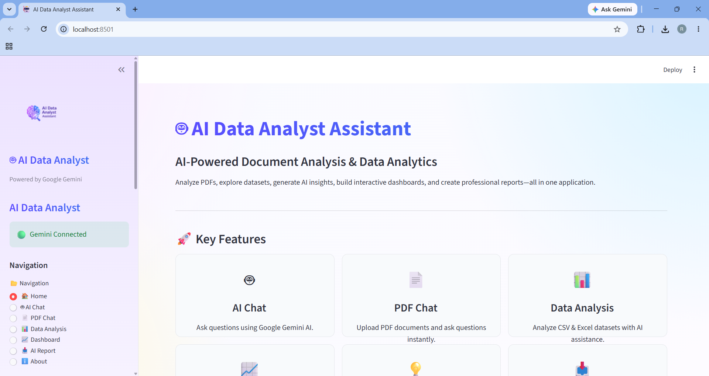
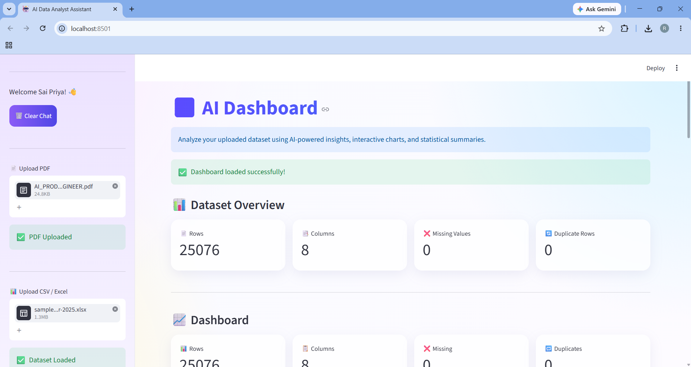
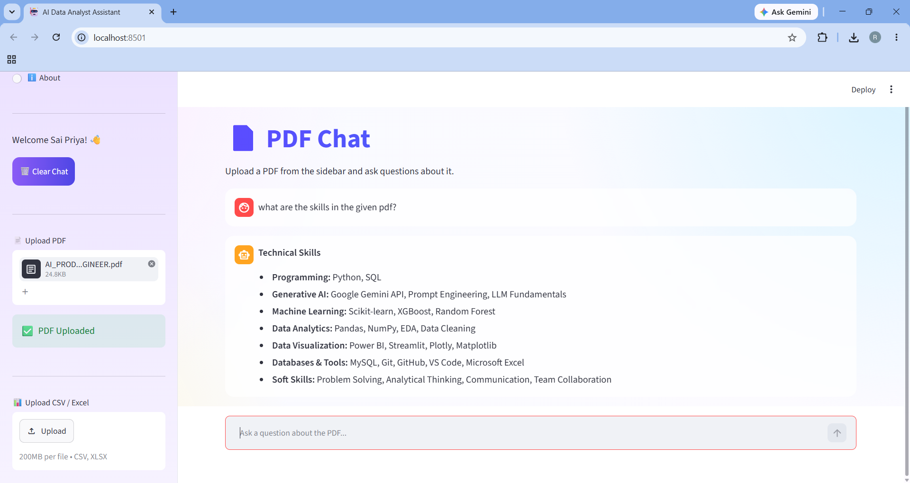
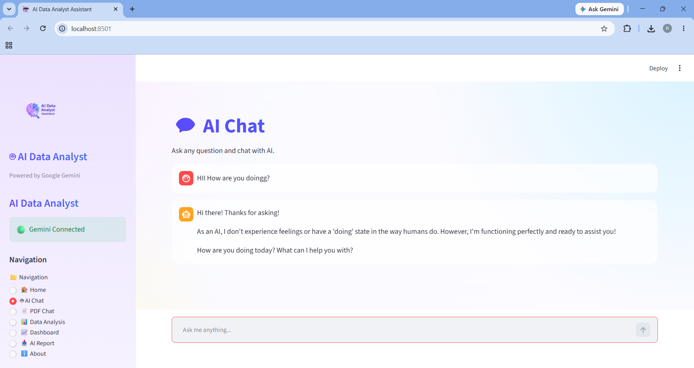

# 🤖 AI Data Analyst Assistant

An AI-powered data analytics application built using **Python**, **Streamlit**, and **Google Gemini AI**. This application enables users to analyze PDF documents, explore CSV/Excel datasets, generate AI-powered insights, visualize data through interactive dashboards, and download professional PDF reports.

---

## 🚀 Features

- 🤖 AI Chat Assistant powered by Google Gemini
- 📄 PDF Question Answering
- 📊 CSV & Excel Data Analysis
- 📈 Interactive Dashboard
- 💡 AI-generated Insights
- 📉 Interactive Charts & Visualizations
- 📋 Dataset Statistics & Preview
- 📥 Professional PDF Report Generation
- 🎨 Modern User Interface
- ⚡ Fast and User-Friendly Navigation

---

## 🛠 Tech Stack

| Category | Technologies |
|----------|--------------|
| Language | Python |
| Framework | Streamlit |
| AI Model | Google Gemini API |
| Data Analysis | Pandas, NumPy |
| Visualization | Plotly |
| PDF Processing | PyPDF |
| Report Generation | ReportLab |
| Environment | Python Dotenv |

---

## 📂 Project Structure

```text
AI_CHAT_ASSISTANT/
│
├── app.py
├── config.py
├── chat_utils.py
├── dashboard.py
├── charts.py
├── excel_utils.py
├── pdf_utils.py
├── report_generator.py
├── insights.py
├── styles.py
│
├── logo.png
├── requirements.txt
├── README.md
├── .env.example
├── .gitignore
│
└── screenshots/
```

---

## 📸 Screenshots

### 🏠 Home Page



---

### 📈 Dashboard



---

### 📄 PDF Chat



---

### 🤖 AI Chat



---

## ⚙ Installation

### 1️⃣ Clone Repository

```bash
git clone https://github.com/YOUR_USERNAME/AI-Data-Analyst-Assistant.git
```

### 2️⃣ Move to Project Folder

```bash
cd AI-Data-Analyst-Assistant
```

### 3️⃣ Install Dependencies

```bash
pip install -r requirements.txt
```

### 4️⃣ Create .env File

```text
GEMINI_API_KEY=YOUR_API_KEY
```

### 5️⃣ Run the Application

```bash
streamlit run app.py
```

---

## 📊 Modules

- AI Chat
- PDF Chat
- Data Analysis
- Dashboard
- AI Insights
- Charts
- PDF Report Generator
- About Page

---

## 🔮 Future Enhancements

- User Authentication
- Database Integration
- Multiple File Upload
- Chat History Download
- Dark Mode
- Multi-language Support
- Cloud Deployment

---

## 👩‍💻 Developer

**Sai Priya**

B.Tech – Computer Science Engineering (AI & ML)

Passionate about Artificial Intelligence, Machine Learning, Data Analytics, and Generative AI.

---

## ⭐ If you like this project

Please consider giving it a ⭐ on GitHub.